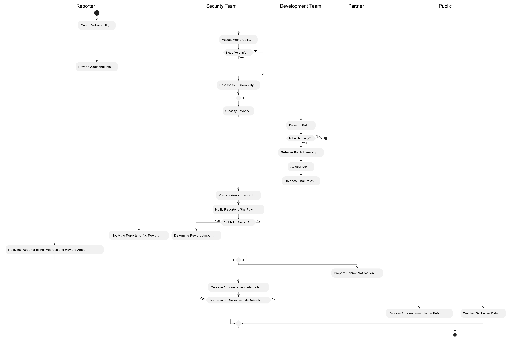

**OceanBase Security Response Protocol**

**Introduction** OceanBase is deeply aware of the significance of security and consistently prioritizes it as an indispensable element of our corporate agenda. OceanBase's dedicated security personnel are committed to the fortification of our applications and products. In pursuit of this objective, we extend a formal invitation to the security community at large to engage in the scrutiny and examination of OceanBase's applications and products.  Should any individual, during the course of such testing, identify a security vulnerability, we kindly ask you to contact us through responsible information disclosure. OceanBase pledges to engage in a prompt and diligent response to such communications and to implement necessary remediations to rectify reported concerns, thereby ensuring the resilience of our infrastructure and honoring our security obligations to our clients. In addition, we shall persist with the extant OceanBase Community Security Group (SIG Security) program, proffering commensurate rewards to parties who contribute valid reports of security breaches. **Contact Information**  To highlight a security report or suggest improvements to our handling process, reach us at [security@oceanbase.com](mailto:security@oceanbase.com). **Scope of Attention**

- OceanBase Database as listed on [**OceanBase Products**](https://www.oceanbase.com/product/)
- Projects on [**OceanBase GitHub**](https://github.com/oceanbase/oceanbase)
- OceanBase [Cloud Services](https://cloud.oceanbase.com/)
- Excluding components or products that have reached the end of their lifecycle

**Guidelines for Information Disclosure** _For Reporters:_

- Prior to submission, please verify against our vulnerability database to confirm that the issue has not been previously reported.
- The environment or system information used for reproducing the issue (e.g., product version, operating system version, and other relevant information);
- The type of vulnerability (e.g., authentication bypass, buffer overflow, horizontal privilege escalation, denial of service, etc.);
- Step-by-step instructions for reproducing the vulnerability;
- Proof of concept code;
- Potential impact of the vulnerability;
- Recommendations for remediation of the vulnerability;
- Contact details of the individual reporting the vulnerability;
- Indicate whether there are any plans for public disclosure of the vulnerability.

_For OceanBase:_

- We will expedite the assessment of your submission and endeavor to establish contact within 2 business days.
- Our objective is to collaboratively establish a reasonable timetable for the remediation of the vulnerability with the affected parties.
- We will compose security advisories and public statements, urging users to update their systems accordingly.
- We commit to implementing preventative strategies, such as root cause analysis, the creation of test suites, and the proactive search for similar vulnerabilities through our continuous integration and testing platforms.

**Code of Conduct for Security Researchers**

- OceanBase advocates for responsible collaborative disclosure and advises vulnerability reporters to maintain confidentiality of vulnerability information prior to formal disclosure, ensuring that when vulnerabilities are revealed, we can concurrently offer our clients remedial solutions or mitigation measures.
- When reporting vulnerabilities associated with OceanBase, please endeavor to minimize access to confidential or non-public information, including third-party data, personal data, or any information marked as "Internal Use" by OceanBase. Apart from the submission to OceanBase, do not store, transfer, utilize, retain, disclose, or replicate such information.
- Unless expressly permitted, refrain from conducting any activities that could potentially impact the integrity or availability of OceanBase systems. Should service performance deterioration or inadvertent non-compliance or service interruption occur during the course of research, cease the use of any automation tools and report the incident immediately.

**Response Process** 

**Assessment Criteria** Vulnerability rating is based on the standards of CVSS 4.0, maintained by the international security organization FIRST, which provides a quantitative scoring mechanism for vulnerabilities through multiple dimensions and classifies the severity of vulnerabilities into categories (Critical, High, Medium, Low) according to the scores. **Assessment Principles**

- When assessing the risk of vulnerabilities, it is imperative to consider specific attack scenarios and evaluate the impact of the vulnerability exploitation on the system's confidentiality, integrity, and availability within that scenario. 
- If a vulnerability has multiple attack scenarios, the attack scenario with the greatest impact, that is, the highest CVSS score, should be used as the baseline. 
- Vulnerabilities introduced by third-party components must be assessed based on the usage of the component within the product and the attack scenarios identified for the vulnerability. 

**Reward Standard** OceanBase shall issue rewards for each new valid security vulnerability report. The range of the reward amount will be based on factors such as the level of the vulnerability, the scope of impact, the CVSS score, etc. We will also extend our gratitude to the vulnerability reporters in each security announcement.
