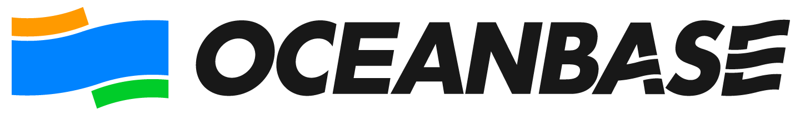

### Hey, this is OceanBase 👋 

OceanBase is an enterprise distributed relational database with high availability, high performance, horizontal scalability, and compatibility with SQL standards. It was born in 2010, and the OceanBase CE (Community Edition) was open sourced on June 1st, 2021.

For more information about OceanBase CE, please visit our [homepage](https://open.oceanbase.com/).

### Get started with OceanBase

There are many projects in the OceanBase community, all of which can be found on GitHub or [software center](https://en.oceanbase.com/softwarecenter).

#### OceanBase Kernel

We have open sourced several million lines of OceanBase database kernel code and corresponding documents:

- [https://github.com/oceanbase/oceanbase](https://github.com/oceanbase/oceanbase)
- [https://github.com/oceanbase/oceanbase-doc](https://github.com/oceanbase/oceanbase-doc)

#### Database Management and Monitoring

Open source projects:

- [obdeploy](https://github.com/oceanbase/obdeploy): A deployer and package manager for OceanBase.
- [obproxy](https://github.com/oceanbase/obproxy): A proxy server for OceanBase Database.
- [ob-operator](https://github.com/oceanbase/ob-operator): A Kubernetes operator for OceanBase Database.
- [obagent](https://github.com/oceanbase/obagent): A monitor collection framework for OceanBase.
- [oceanbase-diagnostic-tool](https://github.com/oceanbase/oceanbase-diagnostic-tool): A diagnostic toolkit for OceanBase.

Community tools:

- OCP CE: The community edition of [OCP](https://www.oceanbase.com/en/product/ocp), a cluster management platform for OceanBase CE.

#### Drivers and Clients

Open source projects:

- [obclient](https://github.com/oceanbase/obclient): A MariaDB-based command line tool to connect to OceanBase Database.
- [ob-connector-odbc](https://github.com/oceanbase/ob-connector-odbc): The ODBC driver used to connect to OceanBase Database.
- [obconnector-c](https://github.com/oceanbase/obconnector-c): A C driver used to connect to OceanBase Database.
- [obconnector-j](https://github.com/oceanbase/obconnector-j): A JDBC driver used to connect to OceanBase Database, also known as `oceanbase-client`.
- [obkv-table-client-java](https://github.com/oceanbase/obkv-table-client-java): A Java Library that can be used to access table data from OceanBase storage layer.
- [obkv-table-client-rs](https://github.com/oceanbase/obkv-table-client-rs): A Rust Library that can be used to access table data from OceanBase storage layer.
- [obkv-hbase-client-java](https://github.com/oceanbase/obkv-hbase-client-java): A Java Library that can be used to access data from OceanBase by HBase-0.94 API.

Community tools:

- ODC CE: The community edition of [ODC](https://www.oceanbase.com/en/product/odc), a development platform tailored for OceanBase CE.

#### Data Integration and Data Migration

Open source projects:

- [oblogmsg](https://github.com/oceanbase/oblogmsg): A C++ library used to struct the commit log data.
- [oblogproxy](https://github.com/oceanbase/oblogproxy): A proxy server based on [oblogmsg](https://github.com/oceanbase/oblogmsg), can be used to get commit log data with [oblogclient](https://github.com/oceanbase/oblogclient).
- [oblogclient](https://github.com/oceanbase/oblogclient): A Java library to get commit log data from OceanBase.
- [canal](https://github.com/oceanbase/canal): A fork of [alibaba/canal](https://github.com/alibaba/canal), can be used to fetch the in-time change events from OceanBase.
- [flink-connector-oceanbase](https://github.com/oceanbase/flink-connector-oceanbase): A sink connector of Apache Flink for OceanBase.

Community tools:

- OceanBase Loader and Dumper: Data export tool tailored for OceanBase CE.
- OMS CE: The community edition of [OMS](https://www.oceanbase.com/en/product/oms), a data migration tool for OceanBase CE and heterogeneous MySQL database.

#### Testing

- [sqlsmith](https://github.com/oceanbase/sqlsmith): A fork of [anse1/sqlsmith](https://github.com/anse1/sqlsmith), a random SQL query generator.
- [sqlancer](https://github.com/oceanbase/sqlancer): A fork of [sqlancer/sqlancer](https://github.com/sqlancer/sqlancer), can be used to detect Logic Bugs in DBMS.

#### Demonstration

- [ob-example](https://github.com/oceanbase/ob-example): A collection of examples to work with OceanBase.
- [miniob](https://github.com/oceanbase/miniob): An educational database project helping developers to learn how database works.

#### Documentation

You can find all documentation repositories at https://github.com/orgs/oceanbase/repositories?q=doc . If you have any questions about the content, welcome to raise an issue or a pull request for it on the repository directly.

#### Ecosystem Projects

The OceanBase community provides many solutions together with other communities and partners, such as [CloudCanal](https://www.clougence.com/cloudcanal), [Flink CDC](https://github.com/ververica/flink-cdc-connectors) and [Apache DolphinScheduler](https://github.com/apache/dolphinscheduler) etc.

We will create new repository to collect all the information about ecosystem projects on GitHub in the near future, and welcome more communities and developers to join our ecosystem. Let's do some cool stuff together!

### Get in touch

- GitHub: [Issues](https://github.com/oceanbase/oceanbase/issues) [Discussions](https://github.com/oceanbase/oceanbase/discussions)
- Forum（简体中文）: https://ask.oceanbase.com
- WeChat Bot: OBCE666
- DingTalk Group: 33254054
- Slack Channel: https://oceanbase.slack.com [[join]](https://join.slack.com/t/oceanbase/shared_invite/zt-1e25oz3ol-lJ6YNqPHaKwY_mhhioyEuw)
- Mailing List: open_contact@oceanbase.com
